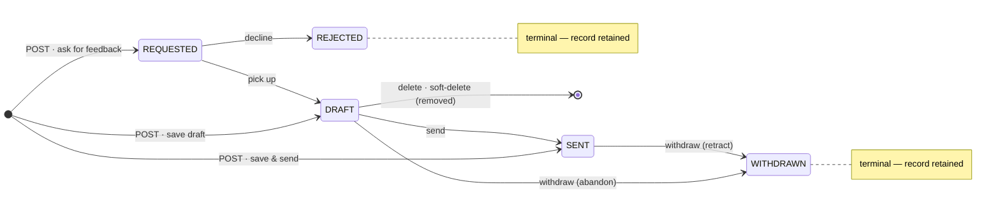

### Feedback lifecycle (statuses & transitions)

A feedback moves through a small state machine. The authoritative rules live in `feedbacks/FeedbackService.kt` — `isAllowedTransition` (the edges) and `validate` (the invariants); read/write authorization is in `authz/Guards.kt`. `FeedbackStatus` (`feedbacks/Feedback.kt`) has five values:

- **`REQUESTED`** — feedback has been requested of a provider (e.g. via "Ask for feedback"); awaits the provider picking it up or declining. **Requires a non-null requester.**
- **`DRAFT`** — the provider's private work in progress; **hidden from the subject** until it leaves `DRAFT`.
- **`SENT`** — delivered; visible to the subject / requester per `FeedbackVisibility`.
- **`WITHDRAWN`** — terminal; the provider retracted the feedback.
- **`REJECTED`** — terminal; the provider declined a request.

Create (`POST`) permits any status (no transition gate); the realistic entry points are
`REQUESTED`/`DRAFT`/`SENT`. `WITHDRAWN`/`REJECTED` are terminal records that are **retained**;
the `DRAFT → [*]` edge is the provider-only **soft-delete** (the row is flagged and drops out of
reads/lists, distinct from the retained terminal states). Details below.

**Allowed transitions** (anything not listed → `409` via `ConflictException` from `FeedbackService.transition`, mapped by `StatusPages`; `WITHDRAWN` and `REJECTED` are terminal with no outgoing edges):

| From → To | Who | Meaning |
|---|---|---|
| `REQUESTED → DRAFT` | provider | provider picks up the request |
| `REQUESTED → REJECTED` | provider | provider declines the request (terminal) — also reached automatically by the v3.8.0 lazy expiry sweep once `expiresOn` has passed, see "Feedback request expiration" below |
| `DRAFT → SENT` | provider | deliver the feedback |
| `DRAFT → WITHDRAWN` | provider | abandon a draft (terminal) |
| `SENT → WITHDRAWN` | provider | retract a sent feedback (terminal) |

Every transition is performed via a dedicated **POST action endpoint** — `POST /api/v1/feedbacks/{id}/send` / `/withdraw` / `/reject` / `/pick-up` (no body; shared `transitionTo` handler in `feedbacks/FeedbackRoutes.kt`) — and is gated by `canWriteFeedback` (provider only — ADMIN does not get feedback write access), so only the provider can send, withdraw, pick up, or reject.

**Delete (separate from the transitions).** `DELETE /api/v1/feedbacks/{id}` **soft-deletes** a feedback (it disappears from reads/lists; the row and its audit trail are retained). It is **provider-only** (`canWriteFeedback`) and **DRAFT-only** — deleting a non-`DRAFT` feedback is `400` (other statuses use the terminal `WITHDRAWN`/`REJECTED` transitions instead). On delete the route records a deletion **audit event** (`feedbackDeletionEvent`) and, if the feedback has a requester, sends them a **notification with no link** that the provider deleted it (`feedbackDeletionNotifications`). Distinct from `DRAFT → WITHDRAWN`, which keeps the feedback visible as a terminal record.

**Creation vs. update.** On **create** (`POST`) any status is permitted — there is no transition gate, so the UI can create a feedback directly as `SENT` ("save & send") or as `REQUESTED` ("ask for feedback"). The transition check above applies only on **update**. **Provider ≠ subject is enforced at CREATE only** (v2.36.0, route-level in `FeedbackRoutes` — 400 "Feedback about yourself is not supported"; the retired self-reflection feature, see the legacy note below — deliberately NOT in the shared `validate()`, so legacy self rows stay editable). The following invariants are enforced on **both** create and update: requester ≠ provider; `REQUESTED` requires a requester; **a feedback with a requester may not use `PROVIDER_SUBJECT` visibility** (that visibility excludes the requester, so the combination is contradictory); and the mirror image, **`PROVIDER_REQUESTER` visibility requires a requester** (without one that visibility excludes everyone but the provider — and the subject's Received list would leak its preview).

**Multiple recipients (v3.1.0, V72).** A feedback may address up to **four people** (`MAX_FEEDBACK_SUBJECTS` in `feedbacks/Feedback.kt`). Storage: the position-ordered join table `feedback_subjects` (`FeedbackService.FeedbackSubjects`) is the **membership truth**; `feedbacks.subject_id` STAYS NOT NULL and is by construction the position-0 row — the **sort/name anchor** (`sort=subjectName` orders by the FIRST recipient; the legacy `subjectId`/`subjectName`/`subjectDeleted` fields stay on every response = the first recipient), so single-recipient rows are unchanged. Every membership predicate is `anchor OR join` (`subjectIn`/`isSubject` in the service — the `inSubQuery` idiom, no correlated EXISTS): the `received` inbox, the `team` scope, the HR `view=user` party test, the `subjectId` filter, and the `subjectName` substring filter (ANY recipient's name) all match through it; the `Feedback` domain model carries `additionalSubjectIds` (+ the derived `subjectIds`), and `canReadFeedback`'s subject branch / `requireFeedbackReadAllowingManager`'s chain walk (`managesAnySubject` — one upward walk seeded with every recipient, `isInManagementChain(managerId, Set)`) read the whole set. The API: `POST` takes `subjectId` + optional `additionalSubjectIds` (≤3); every response carries `subjects: [{id, name, deleted}]` (position order, ≥1 — a row without join rows falls back to its anchor, so `minItems: 1` always holds); `lastProvidedTo` (the /teams/members "last feedback given" stat) is keyed through the join, so a group feedback counts for EACH recipient. **Rules (create-time, the set is immutable afterwards — PUT stays content/visibility only):** distinct; provider ∉ recipients (the route's "Feedback about yourself" 400 — legacy self rows stay serviceable); **a requested feedback (ask-for / request-for) addresses exactly one person** (`validateSubjects`, 400 — so multi-recipient rows never carry a requester and never sit in REQUESTED); a deactivated recipient is the usual 400. **SPA**: the picker-mode create screens (`/feedback/new` without a `subjectId`, `/kudos/new`) render `components/RecipientsMultiSelect.tsx` (Mantine MultiSelect, `maxValues=4`, selection order = position order, accessible pills via `components/accessiblePill.tsx`); a deep link with a fixed `subjectId` stays single (no adding); Ask/Request stay single. Display everywhere goes through `utils/feedbackSubjects.ts` (`feedbackSubjects` — the `subjects` list with the legacy-pair fallback, `subjectDisplays` — the people line with the caller as "You", `feedbackSubjectNames` — joined for arias): the edit screen's `MetaStrip` people line (built in `FeedbackForm.tsx` since v3.5.0 — `FeedbackMeta` is gone) lists every recipient, the table Subject column and the kudos card map one `PersonCell` per recipient. Notifications fan out — each recipient by their own name, each direct manager with ONLY the recipients who report to them (v3.1.1 — the "who reports to you" template), see `.claude/docs/features/notifications.md`. Tests: `FeedbackMultiSubjectTest` (routes incl. the V72 backfill), the multi cases in `FeedbackNotificationsTest`/`GuardsTest`, `CreateFeedback.test.tsx`/`CreateKudo.test.tsx`/`FeedbackTable.test.tsx`/`Kudos.test.tsx`/`ViewFeedback.test.tsx`, `e2e/tests/feedback-provide.spec.ts` (two recipients).

**No-duplicate invariant.** Creation (any target status) is **409** while an active feedback in `DRAFT` or `REQUESTED` status exists by the same **provider** for the same **requester** (a null requester matches only null) whose recipient set **includes ANY of the new recipients** — the rule is per recipient since v3.1.0 (an open group draft blocks a new single one for any of its people and vice versa); for single-recipient rows that is the classic (subjectId, providerId, requesterId) triple (`FeedbackService.findOpenDuplicate`, checked inside `create()`'s transaction; no DB unique index by design). The `ProblemDetail.instance` carries `/api/v1/feedbacks/{id}` of the existing record (`ConflictException(message, instance)` → `respondProblem`'s `instance` param). Pick-up (`REQUESTED → DRAFT`) is guarded the same way against a matching DRAFT (reachable only with pre-invariant duplicates). The SPA warns **before** the user fills anything: `GET /api/v1/feedbacks/duplicate-check?subjectId&providerId[&requesterId]` (single-subject — the picker screens probe once per picked recipient via `useFeedbackDuplicates`; party-scoped like creation — a matching row always has the caller as a party, so no unrelated draft's existence can be probed) → `{existingId, existingStatus}`; the three create screens (`CreateFeedback` via `FeedbackForm`'s `duplicate` prop — one `DuplicateFeedbackAlert` per affected recipient, named via its `recipientName` prop; `AskFeedback`) render `components/DuplicateFeedbackAlert.tsx` with an edit link (provider) or view link (requester) and disable submission (`hooks/useFeedbackDuplicate.ts`); `RequestFeedback` probes per selected provider through its own `useQuery` (same `["feedbackDuplicate", …]` key prefix) and renders an inline per-row warning instead. Covered by `FeedbackDuplicateTest` + `FeedbackMultiSubjectTest` (server) and the create pages' SPA tests.

**The /feedback create entry (v2.28.0).** `/feedback` (the tabbed lists page, `pages/Feedback.tsx`) carries a **"New feedback"** button in the `PageHeader` actions (v3.3.0 — the primary action lives in the header on every list; it sat below the Provided tab's list from v2.28.1 to v3.2.1) → `/feedback/new` with NO `subjectId` — `CreateFeedback.tsx`'s **picker mode**: instead of the pre-v2.28.0 redirect-to-`/`, the screen renders the recipients picker (`RecipientsMultiSelect` over `useAllUsers` — up to four people since v3.1.0, the caller excluded — feedback about yourself is not supported since v2.36.0; the v2.27.0 `FeedbackForm` `subjectControl`/`submitDisabled` seams, saving disabled until at least one is picked), the duplicate probes run per pick, and Visibility stays the ordinary editable Select. The button passes `back=/feedback?tab=provided`, so save/cancel land on the Provided tab. Deep links carrying a valid `subjectId` (`feedbackProvideLink` — users rows, person cards) render the fixed-subject screen unchanged; a self-targeting `subjectId` resolves to nothing and falls back to the picker (v2.36.0). Tests: the picker-mode cases in `CreateFeedback.test.tsx`, the header-link case in `Feedback.test.tsx`, and `e2e/tests/feedback-provide.spec.ts` (its entry goes through this flow).

**Self-reflection (provider == subject) — LEGACY ROWS ONLY (retired v2.36.0; the Impact log is the replacement — see `.claude/docs/features/impact-log.md`).** New provider == subject feedback is rejected at create (route-level 400, above), and the SPA's creation paths are gone (the `/feedback/self` page + nav leaf/tour step; `RequestFeedback`'s provider picker now excludes the subject too). Pre-existing self rows are ordinary feedbacks and stay fully readable, editable, and transitionable, so their special-casing SURVIVES and must not be "cleaned up": the provider rules give the author full read/write at any status and a chain manager reads once delivered, like any feedback; on transitions everything aimed at the subject/provider (the acting user) is dropped (`feedbackTransitionNotifications`' `isSelfReflection` filter), while requester- and manager-directed notifications survive, worded via the `self` i18next context (`params.self` — `"self"` on the provider/transition/deletion/manager notes, `"reflection"` on the requester's request confirmation; keys `notifications.event.*_self`/`*_reflection` + the matching `NotificationEmail` branches — stored notification rows keep rendering through them). The SPA's read-path "You" rendering (ViewFeedback/EditFeedback incl. the requested-self triage branch + `feedback.triageLine_self`) stays too. Tests: the create-rejection + legacy-row regression in `FeedbackRoutesTest`, the pure self-fixture cases in `FeedbackNotificationsTest` + `NotificationEmailTest`, `RequestFeedback.test.tsx` (subject excluded).

**Requester message.** A feedback carries an optional `requesterMessage` (`feedbacks.requester_message`, `V20`) — the requester's clarification note to the provider, captured by the "Ask for feedback" / "Request feedback" forms (`AskFeedback.tsx` / `RequestFeedback.tsx`). It is **set once at creation and never updated**: `FeedbackService.update` simply omits the column, so `PUT` cannot change it (no validation error — the field is ignored). The SPA displays it read-only via `web/src/components/RequesterMessage.tsx` (renders nothing when null/empty) on the view screen, the `REQUESTED` triage screen, and the `DRAFT` editor.

**Feedback request expiration (v3.8.0).** A `REQUESTED` feedback may carry an optional `expiresOn` deadline (`feedbacks.expires_on`, `V76` — nullable strict-ISO `VARCHAR(10)`, the business-date convention: lexicographic order == chronological). Set **once at creation only**: unlike `requesterMessage` (which the `PUT` body accepts but silently drops), `FeedbackContentUpdate` (the `PUT` body, `feedbacks/Feedback.kt`) has **no `expiresOn` field at all** — a client sending the key is rejected as a `400` (strict JSON, `plugins/Serialization.kt` — unknown keys are not ignored), not silently discarded — and `FeedbackService.update`/`editContent` likewise omit the column. Meaningful only while the row stays `REQUESTED`: `validateFeedbackExpiry` (`feedbacks/Feedback.kt`, called from the create route **after** the authz guard — 403 wins over 400) rejects (`400`) an `expiresOn` set on any other status, a malformed date (`parseIsoDateStrict`), or one more than a day in the past (`parsed < today.minusDays(1)`, the goals/KPI/career one-day-UTC-slack precedent — an injectable `today` mirrors `validateGoalDueDate`'s testability pattern). **The lazy sweep — no background job** (pulse's "the server never schedules" posture; this is the first WRITE this codebase performs on a read-only GET path — a deliberate exception, not an established pattern): `FeedbackService.expireOverdueRequests(today: LocalDate = LocalDate.now())` runs at the **top of `GET /api/v1/feedbacks`**, before the list is built, and flips every active `REQUESTED` row whose `expires_on < today` (ISO string compare — a request expiring exactly today is still open, "within the period") to `REJECTED`, bumping `lastModified`, exactly like the manual `POST …/reject`. One `suspendTransaction`, via `updateReturning` — the outcome list is built ONLY from the rows the UPDATE actually locked and flipped, never a separately SELECTed set, so a row a concurrent transition (e.g. a pick-up) moves out of `REQUESTED` between two otherwise-independent calls is simply absent from the result rather than producing a false expiry event/notification for a row that is no longer overdue-REQUESTED; idempotent — a flipped row no longer matches the `REQUESTED` predicate, so a second sweep returns nothing for it. Note the sweep's overdue test (`expires_on < today`) is a **plain UTC-day boundary with no slack of its own** — the one-day tolerance above belongs to `validateFeedbackExpiry` at CREATE time only; a value the create route accepted (`today.minusDays(1)`) is already `< today` by the time the sweep next runs, so it is not "prematurely" expired by the boundary difference. Each flip appends a `REQUEST_EXPIRED` audit event (`FeedbackEventType`, no params — the rendered sentence carries no actor) attributed to the **provider** (`feedback_events.user_id` is `NOT NULL`, so there is no cheap system-user id — the SPA renders this event's actor as "Automatic" rather than the provider's name, see "Feedback events" below) and mints two notifications — `FEEDBACK_REQUEST_EXPIRED_TO_REQUESTER` and `FEEDBACK_REQUEST_EXPIRED_TO_PROVIDER` (params `{requester, provider, subject}`, the `FEEDBACK_REJECTED_TO_REQUESTER` shape), both registered under `FEEDBACKS` in the notification-type→feature map and mirrored by email — see "Notifications" in `.claude/docs/features/notifications.md`. **Accepted tradeoff**: a request no FEEDBACKS-enabled user's `GET /api/v1/feedbacks` ever loads stays `REQUESTED` past its deadline until the next such load (expiry is prompt in practice — the list is hit constantly); the notifications/event are persisted by the ROUTE in separate transactions after the sweep's own transaction commits — the ordinary AUD-001 mutation-vs-event/notification non-atomicity (`persistence.md`'s consistency model), same as every other transition, accepted at this app's scale. Index: `idx_feedbacks_expires_on` (partial, `WHERE expires_on IS NOT NULL`). Tests: `FeedbackExpiryTest` (route-level — create-with-`expiresOn`, the flip + event + both notifications, the exactly-today edge, idempotency, concurrent sweeps, untouched soft-deleted/non-REQUESTED rows, a disabled caller never sweeping), the pure builder cases in `FeedbackEventsTest`/`FeedbackNotificationsTest`/`NotificationEmailTest`, and the create-time 400s in `PayloadValidationTest`.

**Length limits (v2.18.0).** `content` ≤5000 and `requesterMessage` ≤1000 characters — validated up-front (`validateFeedbackTexts` in `feedbacks/Feedback.kt`, called from `FeedbackService.validate` on create and `editContent` on PUT → 400), declared as `maxLength` in the spec, and mirrored client-side (`web/src/utils/feedbackForm.ts` constants; the editor caps typing, the form's `validate` block catches the template-insert path and pre-limit legacy rows, and the shared CharCount shows the live tally). Before v2.18.0 both columns were unbounded — rows longer than the limits may exist; editing one surfaces the form error until shortened.

**Frontend: the `REQUESTED` decision screen.** Because `REQUESTED → SENT` is not a valid edge, the editor must not offer "Save & send" for a pending request. So `web/src/pages/EditFeedback.tsx`, when the loaded feedback is `REQUESTED` and the caller is its provider, renders a read-only **triage screen** (subject + requester names, no editor) instead of the `FeedbackForm` editor, with exactly three actions:

- **Close** — navigate back, change nothing.
- **Reject** — confirmation modal → `REQUESTED → REJECTED`, returns to the originating tab.
- **Accept** — `REQUESTED → DRAFT`, then **reloads in place** (invalidates the `["feedback", id]` query rather than navigating) so the same route re-renders as the normal `DRAFT` editor (Cancel / Save draft / Save & send). `handleSave` distinguishes this case via `accepted = data.status === "REQUESTED" && status === "DRAFT"` and skips the post-save navigate.

**Frontend: the DRAFT editor's Delete action.** The `DRAFT` editor (`FeedbackForm` via `EditFeedback.tsx`) shows a fourth action — a red **Delete** — alongside Cancel / Save draft / Save & send, but only when the caller is the draft's provider (`data.status === "DRAFT" && getUserId() === data.providerId`). It opens a confirmation `Modal` (mirroring the Reject modal) whose confirm calls `deleteFeedback(id)` → on success invalidates `["feedbacks"]`/`["feedback", id]` and navigates to the originating tab. `FeedbackForm` takes optional `onDelete`/`deleting` props and renders the button only when `onDelete` is set.

`FeedbackForm` is therefore only ever the editor for `DRAFT` and the create flows; it carries no reject affordance. This mirrors the backend state machine in the UI (defense-in-depth, not a relaxation of the server check). Covered by `web/src/pages/EditFeedback.test.tsx`.

**Frontend: the simplified requester view.** On the read-only view (`web/src/pages/ViewFeedback.tsx`), when the caller is the **requester** and the feedback is unfinished (`REQUESTED`, `DRAFT`) or declined (`REJECTED`), the **Content** section is hidden — mirroring the server's `canReadFeedbackContent` redaction. The gate is `isRequester && (status === "REQUESTED" || status === "REJECTED" || status === "DRAFT")` (`isRequester = data.requesterId != null && getUserId() === data.requesterId`); every other viewer and status still renders Content. Covered by `web/src/pages/ViewFeedback.test.tsx`.

### Feedback list views (`GET /api/v1/feedbacks?view=…`)

`FeedbackService.list` (`feedbacks/FeedbackService.kt`) scopes rows by `view` + the caller; the shared paging/filter helpers then apply on top. The caller-relative view scopes (the HR auditor `view=user` is documented in `.claude/docs/authorization.md`):

- **`received`** (the subject's inbox): the caller is one of the recipients (`isSubject(caller)` — anchor OR join, v3.1.0), scoped **exactly like `canReadFeedback`** so every listed row is also openable — *caller is the requester* and visibility ∈ {`PROVIDER_REQUESTER`,`PROVIDER_REQUESTER_SUBJECT`} (any status); OR *plain subject* (no requester, or someone else's) and visibility ∈ {`PROVIDER_SUBJECT`,`PROVIDER_REQUESTER_SUBJECT`} and status ∈ {`SENT`,`WITHDRAWN`}; OR `PUBLIC` + `SENT` (either role).
- **`provided`**: `providerId == caller` (every status/visibility).
- **`kudos`** (the org-wide Kudos wall, v2.2.0): **every** row with `visibility = PUBLIC` and `status = SENT`, no caller anchor — exactly the rows `canReadFeedback`'s PUBLIC+SENT branch already grants **any** authenticated caller, so the scope adds no new read surface. Kudos rows additionally carry the **full decrypted `content`** next to the usual 200-char `contentPreview` (`FeedbackListItem.content`, `@EncodeDefault(NEVER)` — the key is OMITTED on every other view; the users-list `teams` idiom) so the wall expands cards inline without a per-card GET. Intended ordering is `sort=-lastModified` (for a SENT row that IS the send moment unless it was edited afterwards via the API — the SPA never edits SENT rows). **SPA**: left-menu **"Kudos"** → `/kudos` (`pages/Kudos.tsx`, gated `FEEDBACKS` in nav + page + the `nav-kudos` tour step) — a newest-first Mantine `Timeline`, each card provider → subject + relative time + the content **always rendered as markdown** inside the shared `ProseBox` frame, clamped to 3 lines (v2.6.3; markdown-in-ProseBox rendering since v2.5.1); a "Show more"/"Show less" toggle renders ONLY when the clamp actually hides something (measured `scrollHeight` overflow) — short cards are non-interactive. No filters, no pagination bar: **the repo's first infinite scroll** (`useInfiniteQuery` + a `useIntersection` sentinel; happy-dom tests stub `IntersectionObserver` — see `Kudos.test.tsx`). **Since v2.27.0 the page has a sticky header** — `PageHeader sticky` (the rule lives in `PageHeader.module.css` since v3.3.0 — `Kudos.module.css` is gone — pinned at `var(--app-shell-header-offset)` so it tracks the dynamic alerts-bar height) holding the title/hint and the **"New kudo"** button → **`/kudos/new`** (`pages/CreateFeedback.tsx` in kudo mode, same FEEDBACKS gate): the `CreateFeedback` flow re-shaped with a **recipients picker** (`RecipientsMultiSelect` over `useAllUsers` — up to four people since v3.1.0, the caller excluded — feedback about yourself is not supported since v2.36.0) and **Visibility pinned to PUBLIC, shown read-only**. The seams are optional `FeedbackForm` props (`subjectControl` — rendered first in the editor-controls row, `visibilityReadOnly` — a `ReadOnlyField` + `VisibilityBadge` replaces the Select, `submitDisabled` — blocks saving until a recipient is picked; the `subjects` people-line prop is optional on the form, whose `MetaStrip` who-line omits the arrow+recipients until a pick resolves). One duplicate probe runs per picked recipient. The result is an **ordinary feedback** — a draft lives under Provided like any other and reaches the wall once SENT; save/cancel land back on `/kudos`. Tests: the three kudos cases in `FeedbackRoutesTest`, `Kudos.test.tsx`, `CreateKudo.test.tsx`, `e2e/tests/kudos.spec.ts`.
- **`team`** (manager oversight): ANY recipient is one of the caller's **direct reports** by default, or — with the strict-boolean `includeIndirect=true` param (`view=team` only, else `400`) — anyone in the caller's **transitive management chain** (`directSubordinateIds`/`transitiveSubordinateIds` in `teams/ManagementChain.kt` — members of non-soft-deleted teams the caller manages, plus recursively the members of teams those members manage; cycle-safe, never the caller themselves), AND (`providerId == caller` OR `requesterId == caller` OR status ∈ {`SENT`,`WITHDRAWN`}) — i.e. a party to it at any status, otherwise only once delivered. The direct-only default is a list scope, not an authorization boundary — the single-GET stays transitive.

Content **previews** are blanked when the feedback is unfinished (`DRAFT`/`REQUESTED`) and the caller is its requester (mirrors `canReadFeedbackContent`). The `/users/:id/feedbacks` page (`ManagerFeedbacks.tsx`) composes two of these as tabs (`?tab=received|provided`, default `received`): received = `received&providerId=:id` ("from them to you"), provided = `provided&subjectId=:id` ("from you to them" — since v3.1.0 membership-based, so a group feedback naming them lists here with every recipient in the Subject cell); its "Back to …" link is origin-aware via `?from=` (+ `?teamId=` for the team-members origin). These list scopes and `canReadFeedback` (the single-GET gate) are maintained separately but are now **fully aligned** — a listed row is always openable: the `received` scope mirrors the read matrix exactly (above), and the manager rule matches in both (delivered-only — `SENT`/`WITHDRAWN` — unless the manager is themselves a party). When changing either, keep the other in sync (`FeedbackRoutesTest` pins the alignment).

### Feedback events (audit history)

`feedback_events` (`feedbacks/FeedbackEvent.kt` DTOs + `FeedbackEventService.kt`; the `FeedbackEventType` enum lives in `feedbacks/FeedbackEvents.kt`; table `V15`) is an **immutable audit trail** of feedback changes: `feedbackId`, `userId` (the acting caller), server-set `timestamp` (epoch millis), and a **structured event** — `event_type` (`FeedbackEventType`: `CREATED`/`DELETED`/`STATUS_CHANGED`/`CONTENT_UPDATED`/`CONTENT_AND_VISIBILITY_UPDATED`/`VISIBILITY_CHANGED`/`REQUEST_EXPIRED`) + a `params` JSON map of enum names (e.g. `{from,to}`; `{}` when none — `REQUEST_EXPIRED` always carries `{}`, see "Feedback request expiration" above). No rendered string is stored — the SPA localizes it. Rows are minted as a side-effect — there is **no create/update/delete API**. The events come from side-effect-free helpers in `feedbacks/FeedbackEvents.kt` (`feedbackCreationEvent` / `feedbackUpdateEvent` / `feedbackDeletionEvent` / `feedbackExpiryEvent` returning a `FeedbackEventDescriptor`, unit-tested in `FeedbackEventsTest`). `feedbacks/FeedbackRoutes.kt` persists them (via `descriptor.toEvent(feedbackId, userId)`): one event on `POST` (create), one on `PUT` when the content/visibility actually changed, one from each `POST …/{id}/send|withdraw|reject|pick-up` action (status transition), and one `REQUEST_EXPIRED` per row the lazy sweep flips at the top of `GET /api/v1/feedbacks` (attributed to the provider — see above). Read via **`GET /api/v1/feedbacks/{id}/events`** → `FeedbackEventList` (`{ items: [...] }`, newest first — v2.8.2, all five `*_events` histories flipped in the shared `EventLog.listFor`, id descending as the same-instant tiebreaker — with resolved `userName`, `type`, `params`); authorized exactly like the single-GET (`requireFeedbackReadAllowingManager`). The SPA shows it as a `Timeline` ("History") on `web/src/pages/ViewFeedback.tsx` via `web/src/components/FeedbackHistory.tsx`, whose `describeEvent` **renders each event in the viewer's language** from `feedback.event.*` keys, interpolating the shared `common.status.*`/`common.visibility.*` labels. **The `REQUEST_EXPIRED` row's actor is never rendered as the provider** (v3.8.1): the event is stored against the provider only because `feedback_events.user_id` is `NOT NULL`, but the flip was automated, not performed by them, so `FeedbackHistory` supplies `EventTimeline`'s optional `renderActor` to show the localized `feedback.event.systemActor` ("Automatic") for that one event type instead of the resolved `userName` — every other event type keeps naming the acting user.

**Feedback bottom-section tabs.** Both the view (`web/src/pages/ViewFeedback.tsx`) and edit (`web/src/components/FeedbackForm.tsx`, when `feedbackId` is set) screens render a three-tab bottom section: **Content**, **History** (the audit `Timeline` above), and **Lifecycle**. The Lifecycle tab renders `web/src/components/FeedbackLifecycle.tsx` — a hand-authored inline-SVG, theme-aware (Mantine CSS vars), end-user-facing state diagram (Requested → Draft → Sent, with terminal Rejected/Withdrawn; the delete path is omitted as it's not a viewable state). It takes an optional `currentStatus` (the live `data.status`, threaded through `FeedbackForm` on edit) to highlight the current node. Labels reuse `common.status.*`; tab/caption strings are `feedback.lifecycle*`.

